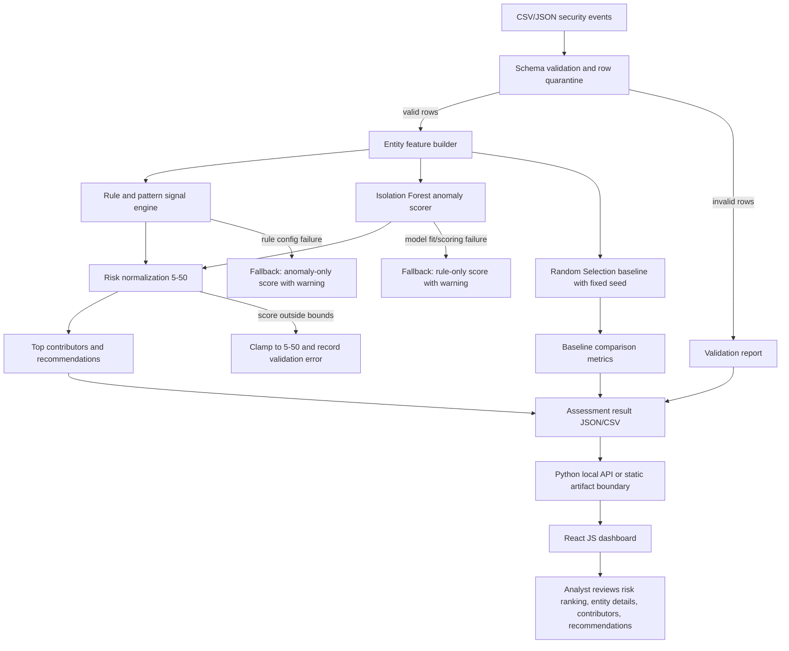

# Architecture: P-006 Predictive Risk Scoring Assessment

## 1. Architecture Overview

### Problem-statement facts

The system must assign dynamic risk scores to entities, surface rules and patterns that contribute to risk, keep scores in the 5-50 range, provide recommendations, and use Python, Isolation Forest, Random Selection, and React JS.

### Selected MVP Architecture

Use a local batch-assessment architecture:

Raw security events -> schema validation -> entity feature aggregation -> rule/pattern signal extraction -> Isolation Forest anomaly scoring -> Random Selection baseline -> score normalization 5-50 -> recommendation mapping -> dashboard-ready assessment output -> React dashboard.

This architecture fits the problem because it directly supports data-driven scoring, contributor visibility, baseline comparison, and a demoable analyst workflow without unnecessary production infrastructure.

### What is intentionally not included

- PostgreSQL: Not required for this problem.
- Microservices: Not required for a 24-hour MVP.
- Streaming queues: Not required for a local batch demo.
- LLM/RAG/vector database: Not required by the problem and not needed for scoring or explainability.
- External APIs: Not required for local, reproducible scoring.

## 2. System Flow

## 3. Component Architecture

| Component | Responsibility | Inputs | Outputs | Dependencies |
|---|---|---|---|---|
| Data Ingestion | Load CSV/JSON event files and normalize field names | Local event file | Raw event records | Python standard libraries, pandas if selected |
| Schema Validator | Enforce required fields and quarantine invalid rows | Raw event records | Valid events, invalid-row report | Schema contract |
| Entity Feature Builder | Aggregate per-entity features over configurable time windows | Valid events | Entity feature table | pandas/numpy if selected |
| Rule/Pattern Signal Engine | Compute explainable risk indicators per entity | Valid events, feature table, rule config | Rule hits, severities, contributor list | Rule catalog |
| Isolation Forest Scorer | Fit/apply anomaly model and produce anomaly scores | Numeric feature table | Per-entity anomaly scores | scikit-learn IsolationForest |
| Random Selection Baseline | Select review candidates at random from same entity population | Entity list, seed, k or review rate | Baseline candidate set | Python random/numpy |
| Risk Normalizer | Combine rule severity and anomaly rank into score 5-50 | Rule signals, anomaly scores | Entity risk score | Configurable weights |
| Recommendation Engine | Convert top contributors into analyst-safe actions | Contributor list, score, entity metadata | Recommendations | Recommendation catalog |
| Results Builder | Produce stable dashboard contract | Scores, explanations, recommendations, validation, baseline | Assessment JSON/CSV | Output schema |
| Local API / Artifact Boundary | Serve results to React or load static generated artifact | Assessment output | Dashboard data response | Python web framework if needed |
| React Dashboard | Present triage, explanations, trends, baseline comparison, validation state | Assessment output | Analyst UI | React JS |
| Validation Harness | Test invariants, edge cases, reproducibility, demo labels | Sample data, outputs | Validation log and metrics | Python test framework |

## 4. Data / Storage Design

### Storage choice

PostgreSQL: Not required for this problem.

The MVP should use local files:

- Input: CSV/JSON event files.
- Intermediate artifacts: feature table and validation report.
- Output: assessment JSON plus optional CSV export.
- Demo data: local synthetic/sample dataset.

This is the simplest mechanism that supports repeatability, avoids setup risk, and allows the React dashboard to consume stable outputs.

### Minimal event schema

| Field | Type | Required | Notes |
|---|---|---|---|
| event_id | string | Yes | Unique event identifier if available; generated only for demo if absent |
| timestamp | ISO datetime | Yes | Used for windows and odd-hour analysis |
| entity_id | string | Yes | User/host/service/device principal |
| entity_type | string | No | user, host, service_account, device, ip |
| event_type | string | Yes | login, file_access, config_change, firewall_event, privilege_change, data_transfer |
| outcome | string | No | success, failure, denied, allowed |
| source_ip | string | No | Optional contributor |
| resource | string | No | File/system/application/resource touched |
| bytes_transferred | number | No | Defaults to 0 when absent |
| severity | number/string | No | Source-provided severity if available |
| metadata | object/string | No | Extra context retained but not required |

### Entity feature examples

- Login count.
- Failed login count.
- Failed login ratio.
- Odd-hour activity count.
- Distinct source IP count.
- Sensitive resource access count.
- Privilege change count.
- Configuration change count.
- Firewall denied count.
- Data transfer volume.
- Deviation from entity's previous window when history exists.

### Assessment output contract

| Field | Type | Meaning |
|---|---|---|
| run_id | string | Unique assessment run |
| generated_at | ISO datetime | Run timestamp |
| entity_id | string | Scored entity |
| entity_type | string | Entity category |
| risk_score | number | Final score in 5-50 |
| risk_band | string | low, medium, high, critical |
| anomaly_score | number/null | Isolation Forest-derived signal |
| rule_score | number | Explainable rule component |
| top_contributors | array | Rule/pattern reasons |
| recommendations | array | Analyst-safe actions |
| selected_by_random_baseline | boolean | Whether random baseline selected entity |
| validation_warnings | array | Any row/model/scoring warnings |

## 5. Core Interfaces

These are implementation contracts, not code.

### Ingestion Interface

Input: local file path and schema profile.

Output:

- valid_events table/list
- invalid_events table/list
- validation_summary

### Feature Builder Interface

Input: valid_events and time_window_config.

Output:

- entity_features with one row per entity per assessment window
- feature_metadata describing feature names, types, defaults, and window

### Scoring Interface

Input:

- entity_features
- rule_signals
- scoring_config

Output:

- anomaly_score per entity
- normalized_risk_score per entity
- model_status and warnings

### Recommendation Interface

Input:

- entity score
- top contributors
- entity metadata

Output:

- ranked recommendations with reason and action type

### Dashboard Data Interface

Input: assessment result artifact or local API response.

Output: React state containing:

- run summary
- entity rankings
- entity detail records
- baseline comparison
- validation report

## 6. Technology Decisions

| Selected Technology | Why | Alternative Considered | Why Rejected | Source Discipline |
|---|---|---|---|---|
| Python | Required/requested and strong ecosystem for data processing and ML | Java | Problem allows Java/Python, but requested plan fixes Python + ML; Python lowers hackathon ML implementation risk | Problem-statement fact + engineering judgment |
| scikit-learn IsolationForest | Directly supports required Isolation Forest model and anomaly scoring | Custom Isolation Forest | Too much implementation risk; less defensible in 24 hours | Official-source fact + engineering judgment |
| Random Selection baseline | Required technology phrase and useful control | No baseline | Would make "improve accuracy/reduce false positives" less measurable | Problem-statement fact + engineering judgment |
| React JS | Required/requested and suitable for dashboard UI | CLI-only UI | Problem asks for visibility; React supports analyst-facing demo | Problem-statement fact |
| Local files for storage | Enough for batch scoring and demo repeatability | PostgreSQL | Adds setup and schema overhead without required persistence | Engineering judgment |
| Rule-based recommendations | Traceable and safe in cyber context | LLM-generated recommendations | External dependency and hallucination risk; not required | Engineering judgment |
| Batch processing | Realistic in 24 hours and supports dynamic recalculation by windows | Streaming pipeline | More infrastructure and testing burden than needed for MVP | Engineering judgment |

## 7. Security / Reliability

### Security controls

- Run locally with no required external data transfer.
- Treat input logs as sensitive; keep demo data pseudonymous.
- Do not execute or eval input file contents.
- Validate file type, required columns, timestamp parsing, numeric conversions, and record limits.
- Do not apply configuration/firewall changes automatically; produce recommendations for human review.
- Avoid storing credentials or production secrets.

### Reliability controls

- Quarantine invalid rows and continue scoring valid rows.
- Record model/rule warnings in assessment output.
- Use deterministic seed for Random Selection baseline.
- Keep score bounds enforced after every scoring run.
- Support fallback scoring if Isolation Forest fails.

## 8. Performance Strategy

Measure, do not assume:

- Ingestion time for demo dataset.
- Feature aggregation time.
- Isolation Forest fit/score time.
- Dashboard data load/render time.
- Peak input row count tested locally.

Target for hackathon MVP: comfortably process the demo dataset on a normal laptop. Any larger-scale claim must be backed by measured results.

## 9. Failure & Fallback Strategy

| Failure | Detection | Fallback |
|---|---|---|
| Missing required columns | Schema validation | Stop run with clear validation error if entity_id/timestamp/event_type missing |
| Some malformed rows | Row-level validation | Quarantine rows and continue with valid rows |
| Empty valid dataset | Validation summary | Stop scoring and show "no valid events" state |
| Non-numeric feature values | Feature validation | Coerce safe defaults where defined; otherwise quarantine affected row/entity |
| Isolation Forest fit failure | Exception/model status | Use rule-only risk score and visible warning |
| Rule config invalid | Config validation | Disable invalid rule and record warning; do not silently score it |
| Score outside 5-50 | Post-score invariant check | Clamp and record validation warning; fix formula before final demo |
| Random baseline non-reproducible | Seed missing or changed | Require seed in run config |
| Dashboard cannot load result | Fetch/parse error | Show error state with run/log guidance |
| Recommendation missing for high-risk contributor | Recommendation validation | Use generic "review related activity" fallback and flag catalog gap |

## 10. Engineering Invariants

- Every scored row must have an entity_id.
- Every final risk_score must be within 5 and 50.
- Every high-risk or critical entity must include at least one contributor and one recommendation.
- Random Selection baseline must draw from the same entity population as the scoring system.
- Demo runs must be reproducible with the same data and seed.
- Invalid input rows must not crash the entire assessment when valid rows remain.
- The dashboard must distinguish model-derived signal, rule-derived signal, and random baseline.
- No component may claim accuracy improvement without measured comparison.
- Recommendations must not be executed automatically.

## 11. Technical Trade-offs

| Trade-off | Decision | Reason |
|---|---|---|
| Explainability vs model complexity | Use Isolation Forest plus rule contributors | Isolation Forest satisfies ML requirement; rules make outputs understandable |
| Real-time adaptation vs 24-hour feasibility | Use batch/window-based recalculation | Demonstrates dynamic scoring without streaming infrastructure |
| Persistence vs simplicity | Use local artifacts | Enough for demo and easier to validate |
| Accuracy proof vs label scarcity | Use baseline and optional demo labels | Avoids unsupported claims |
| Automated remediation vs safety | Recommendations only | Human review is safer for firewall/config actions |

## 12. Accepted Technical Debt

- Rule weights may be manually configured for MVP and should be revisited after real labeled feedback.
- Synthetic/demo labels can support demonstration but cannot prove production effectiveness.
- No production authentication/authorization layer.
- No production-scale monitoring or model drift management.
- Limited connector support; local file ingestion only.
- Feature importance for Isolation Forest will be approximated through rule contributors and feature deltas, not true model explainability, unless time permits a validated method.

## Evidence / Source Discipline

| Decision | Evidence / Source | Reason | Confidence |
|---|---|---|---|
| Isolation Forest as anomaly scorer | scikit-learn documents IsolationForest anomaly scoring behavior and parameters; original Isolation Forest paper describes anomaly detection through isolation. | Required model aligns with sparse anomaly detection where labels may be unavailable. | High |
| Baseline through random selection | Random selection provides a chance-level comparison for prioritized review. Reproducibility should use fixed seed behavior. | Makes "better than random" measurable if labels exist. | Medium |
| Log/event inputs as primary data | CISA describes logging and monitoring as a way to identify anomalies or unauthorized behavior; CERT/SEI discusses collecting and analyzing insider-threat indicators. | Supports data-driven entity health/risk assessment. | High |

External sources used:

- scikit-learn IsolationForest documentation: https://scikit-learn.org/stable/modules/generated/sklearn.ensemble.IsolationForest.html
- Liu, Ting, Zhou, "Isolation Forest", IEEE ICDM 2008: https://doi.org/10.1109/ICDM.2008.17
- CISA logging and monitoring guidance: https://www.cisa.gov/audiences/small-and-medium-businesses/secure-your-business/use-logging-on-business-systems
- CERT/SEI insider threat data collection and analysis: https://insights.sei.cmu.edu/blog/intp-series-data-collection-and-analysis-part-11-of-18/
