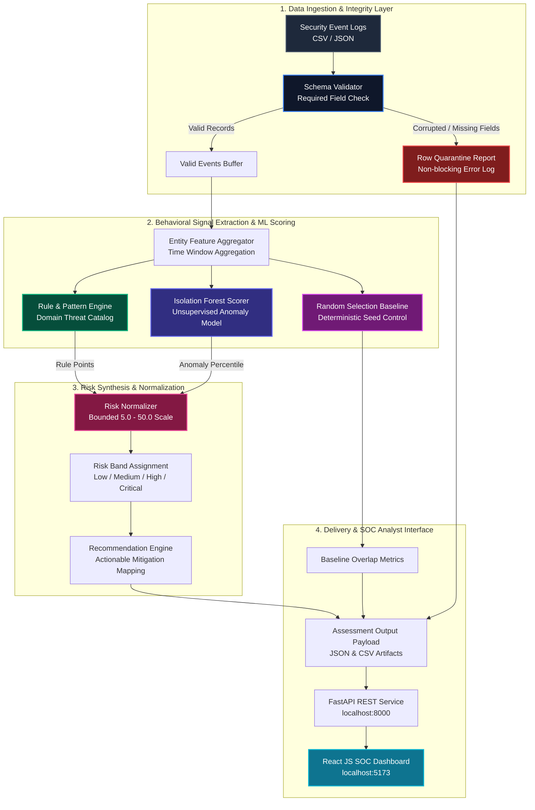
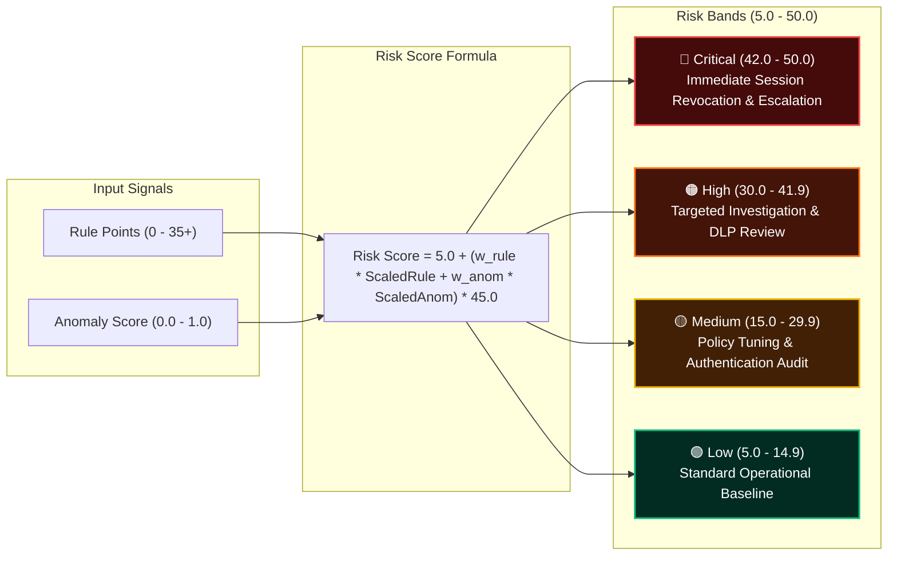

# P-006: Predictive Risk Scoring Assessment

<p align="center">
  
  
  
  
  
  
</p>

<p align="center">
  <strong>Dynamic insider-threat scoring (5.0–50.0 scale) combining unsupervised Isolation Forest anomaly detection, explainable rule extraction, deterministic Random Selection control, and a real-time SOC analyst dashboard.</strong>
</p>

---

## 📑 Table of Contents
- [1. Architecture & System Flow](#1-architecture--system-flow)
- [2. Threat Triage & Scoring Model](#2-threat-triage--scoring-model)
- [3. Key Features & Engineering Invariants](#3-key-features--engineering-invariants)
- [4. Rule Catalog & Mitigation Playbook](#4-rule-catalog--mitigation-playbook)
- [5. Project Directory Structure](#5-project-directory-structure)
- [6. Quickstart Guide](#6-quickstart-guide)
- [7. REST API Reference](#7-rest-api-reference)
- [8. Automated Test Suite](#8-automated-test-suite)

---

## 1. Architecture & System Flow

The platform executes a local batch-scoring workflow that extracts behavioral indicators from event logs, scores statistical isolation via machine learning, evaluates domain threat rules, and normalizes scores into strict bounds for human review.



---

## 2. Threat Triage & Scoring Model

Risk scores combine explainable rule severity with statistical anomaly detection, mapping directly into four operational action bands:



---

## 3. Key Features & Engineering Invariants

| Feature / Invariant | Implementation Mechanism | Verification Guarantee |
|---|---|---|
| **Strict 5.0–50.0 Range** | `backend/src/risk_normalizer.py` | Bounded dynamic scaling with hard clamping at 5.0 and 50.0. Tested via unit tests. |
| **Isolation Forest ML** | `backend/src/anomaly_scorer.py` | Unsupervised contamination fitting with `FALLBACK_RULE_ONLY` safety switch on small samples. |
| **Random Selection Control** | `backend/src/baseline.py` | Fixed-seed chance baseline sampling from identical entity pool to validate ML prioritization lift. |
| **Row-Level Quarantine** | `backend/src/ingestion.py` | Corrupted rows (missing fields, malformed dates) quarantined to log without halting scoring. |
| **SOC Dashboard** | `frontend/src/App.jsx` | Dark-theme command UI, entity deep-dive modal, baseline overlap charts, and what-if parameter sliders. |
| **Evidence Export** | `backend/src/pipeline.py` | Deterministic assessment exports to audit-ready JSON and CSV formats. |

---

## 4. Rule Catalog & Mitigation Playbook

| Rule Identifier | Indicator Pattern | Severity Points | Trigger Threshold | Automated Mitigation Recommendation |
|---|---|---|---|---|
| `R_PRIV_ESCALATION` | Unauthorized Privilege Escalation | Up to +15.0 | $\ge 1$ admin role grant | Urgent IAM privilege audit against change management tickets |
| `R_DATA_EXFIL` | Mass Data Transfer Spike | Up to +15.0 | $\ge 25\text{ MB}$ total / $15\text{ MB}$ single | Network DLP analysis & outbound connection inspection |
| `R_FAILED_LOGINS` | Authentication Failure Burst | Up to +12.0 | $\ge 3$ failures / $\ge 50\%$ ratio | Force MFA challenge, step-up auth, session revocation |
| `R_FW_DENIED` | Firewall Policy Denial Spike | Up to +10.0 | $\ge 3$ denied packets | Ingress/egress ACL tuning & perimeter IP block |
| `R_CONFIG_CHANGE` | Critical System Config Modification | Up to +10.0 | $\ge 2$ configuration edits | Configuration baseline diff & authorization review |
| `R_ODD_HOURS` | Anomalous Off-Hours Activity | Up to +8.0 | $\ge 4$ events outside 07:00-19:00 | Off-shift credential validation & emergency ticket audit |
| `R_DISTRIBUTED_IP` | Multi-Source IP Access Spread | Up to +8.0 | $\ge 4$ distinct IPs | Impossible travel evaluation & IP subnet restriction |

---

## 5. Project Directory Structure

```
P-006/
├── backend/
│   ├── data/
│   │   ├── generate_demo_data.py   # Synthetic security telemetry generator
│   │   ├── security_events.json    # Standard JSON demo dataset
│   │   └── security_events.csv     # Standard CSV demo dataset
│   ├── src/
│   │   ├── api/
│   │   │   └── server.py           # FastAPI REST endpoints
│   │   ├── schema.py               # Data models, validation contracts & bounds
│   │   ├── ingestion.py            # File ingestion & row quarantine
│   │   ├── feature_builder.py      # Entity behavioral feature extraction
│   │   ├── rule_engine.py          # Domain rule catalog & score extraction
│   │   ├── anomaly_scorer.py       # Isolation Forest scoring & fallback
│   │   ├── baseline.py             # Random Selection baseline generator
│   │   ├── risk_normalizer.py      # Bounded [5.0, 50.0] normalization
│   │   ├── recommendations.py      # Actionable remediation advice engine
│   │   └── pipeline.py             # Pipeline orchestrator & file exporter
│   ├── tests/
│   │   └── test_invariants.py      # Pytest automated invariant suite
│   ├── cli.py                      # Command-line assessment tool
│   └── requirements.txt            # Python dependencies
├── frontend/
│   ├── src/
│   │   ├── App.jsx                 # React SOC Dashboard application
│   │   ├── index.css               # Dark theme design system
│   │   └── main.jsx                # React application entry point
│   ├── package.json                # Frontend dependencies
│   └── vite.config.js              # Vite configuration
├── start_system.ps1                # One-click startup script (PowerShell)
├── PRD.md                          # Product Requirements Document
├── ARCHITECTURE.md                 # System Architecture Baseline
├── PROGRESS.md                     # Implementation Progress Log
└── README.md                       # Master Documentation
```

---

## 6. Quickstart Guide

### Prerequisites
- **Python 3.10+**
- **Node.js 18+ & npm**

### 1. One-Click Launch (PowerShell)
```powershell
.\start_system.ps1
```
*Starts the FastAPI backend on `http://127.0.0.1:8000` and launches the React dashboard on `http://127.0.0.1:5173`.*

---

### 2. Manual Service Setup

**A. Backend API:**
```bash
pip install -r backend/requirements.txt
python -m uvicorn backend.src.api.server:app --host 127.0.0.1 --port 8000
```

**B. Frontend Dashboard:**
```bash
cd frontend
npm install
npm run dev -- --host 127.0.0.1 --port 5173
```

**C. CLI Batch Assessment:**
```bash
python backend/cli.py --file backend/data/security_events.json --seed 42
```

---

## 7. REST API Reference

| HTTP Method | Endpoint | Description |
|---|---|---|
| `GET` | `/api/health` | Service health status. |
| `GET` | `/api/assessment/latest` | Retrieve current assessment results with entity rankings. |
| `POST` | `/api/assessment/run` | Trigger dynamic re-scoring with custom weights, seed, or contamination. |
| `POST` | `/api/assessment/upload` | Upload custom CSV/JSON event file and compute risk scores. |
| `GET` | `/api/assessment/export/csv` | Download assessment report as CSV. |
| `GET` | `/api/assessment/export/json` | Download full assessment payload as JSON. |

*Interactive Swagger UI available at [http://127.0.0.1:8000/docs](http://127.0.0.1:8000/docs).*

---

## 8. Automated Test Suite

Run the full invariant test harness:
```bash
pytest backend/tests/ -v
```

```text
backend/tests/test_invariants.py::test_invariant_1_score_bounds_and_validity PASSED
backend/tests/test_invariants.py::test_invariant_2_entity_id_integrity PASSED
backend/tests/test_invariants.py::test_invariant_3_high_risk_explanation_coverage PASSED
backend/tests/test_invariants.py::test_invariant_4_baseline_population_alignment PASSED
backend/tests/test_invariants.py::test_invariant_5_row_quarantine_resilience PASSED
backend/tests/test_invariants.py::test_invariant_6_reproducibility_with_seed PASSED
backend/tests/test_invariants.py::test_extreme_score_clamping PASSED
backend/tests/test_invariants.py::test_empty_dataset_graceful_handling PASSED

============================== 8 passed ==============================
```

---

<p align="center">
  <sub>Built for IBM Problem Statement P-006: Predictive Risk Scoring Assessment</sub>
</p>
